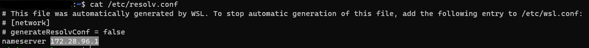

# Arduino FM receiver

In this repository you can find the Arduino FM receiver that is used to capture RDS package from FM frequencies and extracts information such as:

- Sender station;
- Program Identifier Code (PI Code);
- Text:
  - Messages;
  - Song name;
  - other information.

You can find all information about the library in this repository <a target = "_blank" href = "https://github.com/mathertel/Radio">https://github.com/mathertel/Radio</a> 

In order to use the information some changes have been made to the original library.


## Wiring diagram

| *SI4703* | *Arduino Mega* |
| :------: | :------------: |
|   3.3V   |      3.3V      |
|   GND    |      GND       |
|   SDIO   |    SDA (20)    |
|   SCLK   |    SCL (21)    |
|   RST    |       52       |


## Usage

First of all you have to download the Arduino IDE tar.xz from this link: <a href="https://www.arduino.cc/en/software">https://www.arduino.cc/en/software</a> or using the following command:

```bash
wget https://downloads.arduino.cc/arduino-1.8.13-linux64.tar.xz
```

Move the `arduino-<version>` inside **/YouDontNeedSpotify/Arduino** and build the package using the following commands:

```bash
cd YouDontNeedSpotify/Arduino
docker build --tag youdontneedspotify:ArduinoRadio .
```

If you get an error you have to modify the Arduino IDE tar.xz inside the *Dockerfile*.

After that you have to go in **YouDontNeedSpotify/Arduino/bin**:

- *arduino-builder.sh* create a container called ArduinoBuilder, then you have to write the Arduino port and the sketch is uploaded into Arduino.
- *arduinoIDE.sh* create a container called ArduinoIDE that permits to use the IDE without any installation [NOT TESTED IN MAC].

**While using these scripts some errors and warnings will be shown, don't worry!**


## On Windows (WSL)

Download and install <a target="_blank" href="https://www.docker.com/products/docker-desktop">Docker Desktop</a>.

Download and install <a target="_blank" href="https://sourceforge.net/projects/vcxsrv/">VcXsrv</a>.

Now follow these steps:


Now use the following command:

```bash
cat /etc/resolv.conf
```

Take note of the nameserver.



After that, you have to use these command:

```bash
cd ~
nano .bashrc
```

At the end insert:

```bash
export DISPLAY=<nameserver>:0.0
export LIBGL_ALWAYS_INDIRECT=1
```

Use `CTRL+O` and `RETURN` to save; `CTRL+X` and `RETURN` to exit.

Then use:

```bash
source .bashrc
```

Everything is ready to use the script that are inside **YouDontNeedSpotify/Arduino/bin**.

## Example

```bash
<START>
Station:101.80 MHz
Radio: --- -----  MONO   RSSI: 8  SNR: 0
Audio: ---- SOFTMUTE ----
Sender:<RTL102.5>
<END>
<START>
Station:101.90 MHz
Radio: --- -----  MONO   RSSI: 1  SNR: 0
Audio: ---- SOFTMUTE ----
<END>
<START>
Station:102.00 MHz
Radio: --- -----  MONO   RSSI: 0  SNR: 0
Audio: ---- SOFTMUTE ----
<END>
<START>
Station:102.10 MHz
Radio: --- -----  MONO   RSSI: 0  SNR: 0
Audio: ---- SOFTMUTE ----
<END>
<START>
Station:102.20 MHz
Radio: --- -----  MONO   RSSI: 2  SNR: 0
Audio: ---- SOFTMUTE ----
<END>
<START>
Station:102.30 MHz
Radio: --- -----  MONO   RSSI: 1  SNR: 0
Audio: ---- SOFTMUTE ----
<END>
<START>
Station:102.40 MHz
Radio: --- -----  MONO   RSSI: 3  SNR: 0
Audio: ---- SOFTMUTE ----
<END>
<START>
Station:102.50 MHz
Radio: --- -----  MONO   RSSI: 4  SNR: 0
Audio: ---- SOFTMUTE ----
<END>
<START>
Station:102.60 MHz
Radio: --- -----  MONO   RSSI: 5  SNR: 0
Audio: ---- SOFTMUTE ----
<END>
<START>
Station:102.70 MHz
Radio: --- -----  MONO   RSSI: 2  SNR: 0
Audio: ---- SOFTMUTE ----
<END>
<START>
Station:102.80 MHz
Radio: --- -----  MONO   RSSI: 5  SNR: 0
Audio: ---- SOFTMUTE ----
<END>
<START>
Station:102.90 MHz
Radio: --- -----  MONO   RSSI: 13  SNR: 0
Audio: ---- SOFTMUTE ----
<END>
<START>
Station:103.00 MHz
Radio: --- -----  MONO   RSSI: 29  SNR: 0
Audio: ---- SOFTMUTE ----
Sender:< FRECCIA>
Text: <THE KILLERS - HUMAN                                             >
Text: <THE KILLERS - HUMAN                                             >
<END>
```

